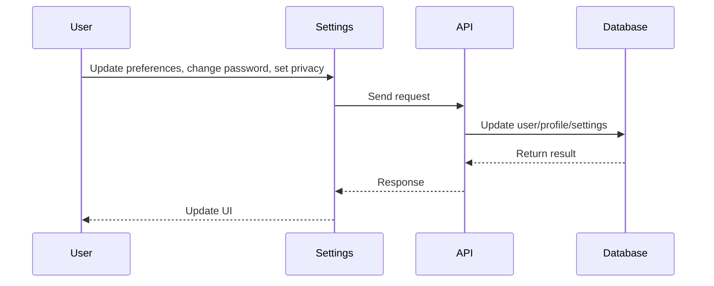
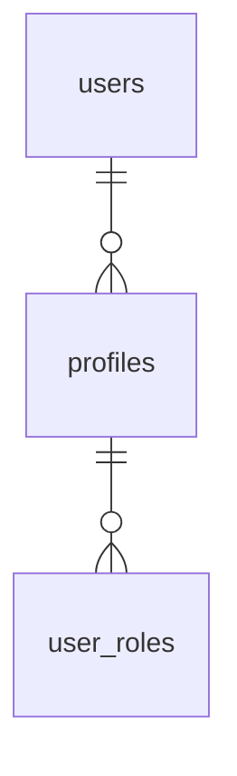

# Settings

## Introduction
The Settings page allows users to manage their account preferences, notification settings, privacy controls, and security options.

## Data Flow Diagram Context


## Use Cases Diagram Context
```mermaid
usecaseDiagram
  actor User
  User --> (Update Account Info)
  User --> (Change Password)
  User --> (Set Notification Preferences)
  User --> (Manage Privacy Settings)
  User --> (Enable 2FA)
```

## Database Design


## Summary
The Settings page empowers users to personalize and secure their account experience. 