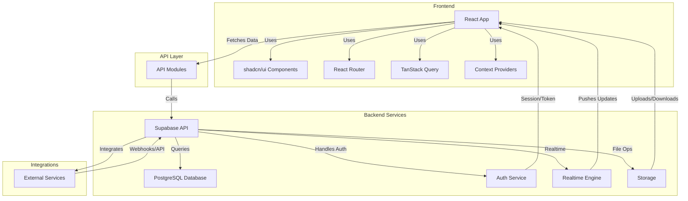

# System Architecture

## Introduction
The Focus Hub system architecture is designed for modularity, scalability, and real-time collaboration. It integrates a modern React frontend, a robust API layer, Supabase for backend services (database, authentication, real-time), and external integrations. This architecture ensures secure, efficient, and seamless user experiences across all modules and features.

## System Architecture Diagram


## Deployment Architecture

The deployment architecture for Focus Hub ensures reliable, automated, and scalable delivery of the application to end users. It leverages CI/CD pipelines, cloud hosting, and managed backend services for seamless updates and high availability.

```mermaid
graph TD
  Dev[Developer]
  Repo[Git Repository]
  CI[CI/CD Pipeline]
  Build[Build Server]
  Host[Hosting/CDN (e.g., Vercel, Netlify)]
  User[End User]
  Supabase[Supabase Backend]

  Dev -- "Push Code" --> Repo
  Repo -- "Trigger Build" --> CI
  CI -- "Run Tests & Build" --> Build
  Build -- "Deploy Artifacts" --> Host
  Host -- "Serve Frontend" --> User
  User -- "API Requests" --> Supabase
  Host -- "API Proxy" --> Supabase
  Supabase -- "Database/Auth/Storage" --> Supabase
```

### Deployment Flow Summary
- Developers push code to the Git repository.
- The CI/CD pipeline runs automated tests and builds the application.
- Build artifacts are deployed to a cloud hosting provider with CDN (e.g., Vercel, Netlify).
- The frontend is served globally via CDN for fast access.
- API requests from the frontend are proxied to Supabase, which handles database, authentication, real-time, and storage operations.
- This architecture supports rapid iteration, automated rollbacks, and high availability for all users.

## Summary
This architecture enables Focus Hub to deliver a secure, real-time, and feature-rich experience. The frontend communicates with the backend via a modular API layer, while Supabase provides authentication, database, storage, and real-time capabilities. External integrations further extend the platform's functionality, supporting a scalable and maintainable system design. 