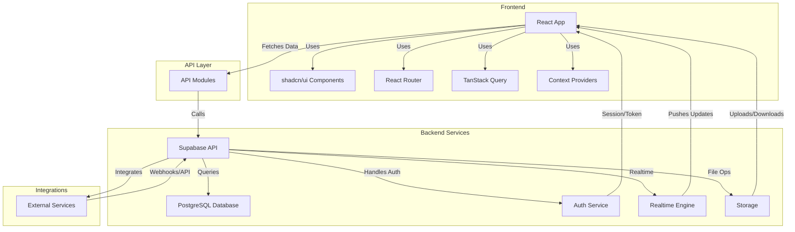

# System Architecture

## Introduction
The Focus Hub system architecture is designed for modularity, scalability, and real-time collaboration. It integrates a modern React frontend, a robust API layer, Supabase for backend services (database, authentication, real-time), and external integrations. This architecture ensures secure, efficient, and seamless user experiences across all modules and features.

## System Architecture Diagram

## Summary
This architecture enables Focus Hub to deliver a secure, real-time, and feature-rich experience. The frontend communicates with the backend via a modular API layer, while Supabase provides authentication, database, storage, and real-time capabilities. External integrations further extend the platform's functionality, supporting a scalable and maintainable system design. 