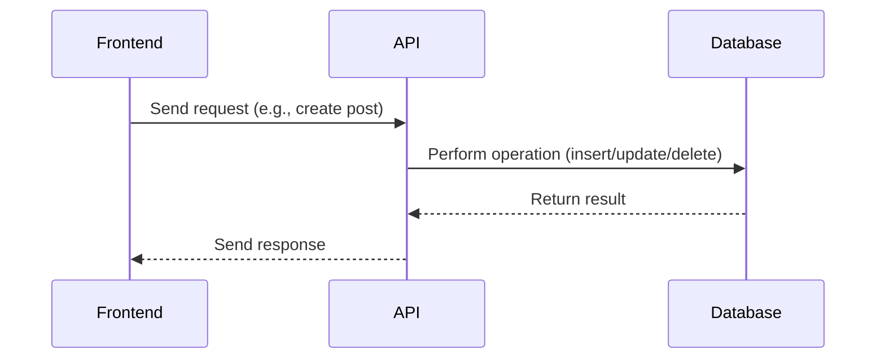

# API Layer

## Introduction
The API Layer acts as the bridge between the frontend application and the backend database, handling all data operations such as creating, reading, updating, and deleting resources. It abstracts the complexity of direct database access and enforces business logic and security.

## What Problem Does It Solve?
- Centralizes data access and manipulation logic.
- Ensures consistent validation and error handling.
- Provides a single point for integrating with external services or APIs if needed.

## Key Concepts
- **Endpoints:** Define how the frontend communicates with the backend for different resources (e.g., posts, comments, votes).
- **Request Handling:** Validates and processes incoming requests, interacts with the database, and returns structured responses.
- **Security:** Enforces authentication and authorization, ensuring only permitted actions are allowed.

## Data Flow Diagram Context

## Use Cases Diagram Context
- User creates a new post or comment.
- User votes on a post or answer.
- User fetches a list of resources (posts, comments, answers).

## Database Design
- Interacts with tables such as `posts`, `comments`, `votes`, `answers`.
- Enforces Row Level Security (RLS) for all operations.

---
The API Layer ensures all data operations are secure, validated, and consistent across the application.

## Index
- [index.js](#indexjs)
- [comments.js](#commentsjs)
- [votes.js](#votesjs)
- [answers.js](#answersjs)

---

## index.js

### Data Flow Diagram Context
- Handles API routing and aggregation for Q&A, comments, and votes.

### Use Cases Diagram Context
- Entry point for API requests related to Q&A features.

---

## comments.js

### Data Flow Diagram Context
- Manages comment creation, retrieval, and association with Q&A posts.

### Use Cases Diagram Context
- Users can add, view, and manage comments on Q&A posts.

### Database Design
- Table: `comments`
  - id (PK)
  - post_id (FK)
  - user_id (FK)
  - content
  - created_at

---

## votes.js

### Data Flow Diagram Context
- Handles voting logic for Q&A posts and answers.

### Use Cases Diagram Context
- Users can upvote or downvote posts and answers.

### Database Design
- Table: `votes`
  - id (PK)
  - user_id (FK)
  - post_id (FK)
  - vote_type
  - created_at

---

## answers.js

### Data Flow Diagram Context
- Manages answer creation, retrieval, and association with Q&A posts.

### Use Cases Diagram Context
- Users can submit and view answers to Q&A posts.

### Database Design
- Table: `answers`
  - id (PK)
  - post_id (FK)
  - user_id (FK)
  - content
  - created_at 