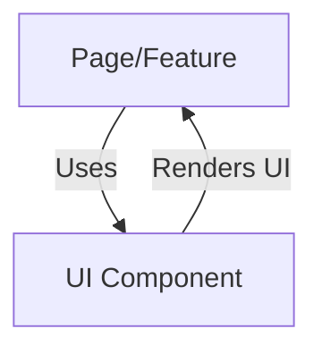

# UI Component Library

## Introduction
The UI Component Library provides a set of reusable, accessible, and customizable building blocks for constructing the application's user interface. It ensures a consistent look and feel across all pages and features.

## What Problem Does It Solve?
- Reduces development time by offering ready-made components.
- Ensures design consistency and accessibility throughout the app.
- Simplifies maintenance and future enhancements.

## Key Concepts
- **Reusable Components:** Buttons, cards, dialogs, forms, and more, designed for flexibility and composability.
- **Styling System:** Uses a utility-first CSS framework and design tokens for theming and responsiveness.
- **Accessibility:** Components are built with best practices for keyboard and screen reader support.

## Data Flow Diagram Context

## Use Cases Diagram Context
- Building forms for login, registration, and posting.
- Displaying lists, cards, and dialogs for content and actions.
- Providing navigation, feedback, and interactive elements.

---
The UI Component Library is the foundation for a cohesive and user-friendly interface.

# UI Components Documentation

This document provides an overview of all UI components in the project, including data flow and use case diagrams, and database design where relevant.

## Index
- [FlaggedContentAdmin.tsx](#flaggedcontentadmintsx)
- [FlagFeature.tsx](#flagfeaturetsx)
- [PostCard.tsx](#postcardtsx)
- [NotificationDropdown.tsx](#notificationdropdowntsx)
- [Header.tsx](#headertsx)
- [CreatePost.tsx](#createposttsx)
- [FollowersStats.tsx](#followersstatstsx)
- [Sidebar.tsx](#sidebartsx)
- [ProfileEditForm.tsx](#profileeditformtsx)
- [ProfileFollowButton.tsx](#profilefollowbuttontsx)
- [FileCard.tsx](#filecardtsx)
- [Layout.tsx](#layouttsx)
- [CreateChat.tsx](#createchattx)
- [ChatNotification.tsx](#chatnotificationtsx)
- [AppSidebar.tsx](#appsidebartsx)
- [AnimatedAtom.tsx](#animatedatomtsx)
- [BackgroundAtom.tsx](#backgroundatomtsx)
- [ProtectedRoute.tsx](#protectedroutetsx)
- [ThemeToggle.tsx](#themetoggletsx)
- [theme-provider.tsx](#theme-providertsx)

---

## FlaggedContentAdmin.tsx
### Data Flow Diagram Context
- Admin interface for reviewing flagged content.
### Use Cases Diagram Context
- Admins can review and take action on flagged posts or comments.

---

## FlagFeature.tsx
### Data Flow Diagram Context
- Allows users to flag inappropriate content.
### Use Cases Diagram Context
- Users can report posts or comments for moderation.

---

## PostCard.tsx
### Data Flow Diagram Context
- Displays individual posts in the feed.
### Use Cases Diagram Context
- Users can view, like, comment, and interact with posts.
### Database Design
- Uses `posts`, `comments`, and `votes` tables.

---

## NotificationDropdown.tsx
### Data Flow Diagram Context
- Shows notifications to users.
### Use Cases Diagram Context
- Users can view recent notifications.

---

## Header.tsx
### Data Flow Diagram Context
- Main navigation header for the application.
### Use Cases Diagram Context
- Users can navigate between main sections.

---

## CreatePost.tsx
### Data Flow Diagram Context
- Form for creating new posts.
### Use Cases Diagram Context
- Users can submit new posts to the feed.
### Database Design
- Uses `posts` table.

---

## FollowersStats.tsx
### Data Flow Diagram Context
- Displays follower statistics for a user.
### Use Cases Diagram Context
- Users can see their follower/following counts.
### Database Design
- Uses `followers` table.

---

## Sidebar.tsx
### Data Flow Diagram Context
- Side navigation for the application.
### Use Cases Diagram Context
- Users can access different modules quickly.

---

## ProfileEditForm.tsx
### Data Flow Diagram Context
- Form for editing user profile information.
### Use Cases Diagram Context
- Users can update their profile details.
### Database Design
- Uses `users` table.

---

## ProfileFollowButton.tsx
### Data Flow Diagram Context
- Button to follow or unfollow users.
### Use Cases Diagram Context
- Users can follow or unfollow other users.
### Database Design
- Uses `followers` table.

---

## FileCard.tsx
### Data Flow Diagram Context
- Displays shared files/resources.
### Use Cases Diagram Context
- Users can view and download shared files.
### Database Design
- Uses `resources` table.

---

## Layout.tsx
### Data Flow Diagram Context
- Provides layout structure for pages.
### Use Cases Diagram Context
- Used by pages to maintain consistent layout.

---

## CreateChat.tsx
### Data Flow Diagram Context
- Form for creating new chat conversations.
### Use Cases Diagram Context
- Users can start new chat sessions.
### Database Design
- Uses `chats` table.

---

## ChatNotification.tsx
### Data Flow Diagram Context
- Displays chat notifications to users.
### Use Cases Diagram Context
- Users are notified of new chat messages.

---

## AppSidebar.tsx
### Data Flow Diagram Context
- Sidebar navigation for the app.
### Use Cases Diagram Context
- Users can access app features from the sidebar.

---

## AnimatedAtom.tsx
### Data Flow Diagram Context
- Animated visual element for UI enhancement.
### Use Cases Diagram Context
- Used for visual feedback or decoration.

---

## BackgroundAtom.tsx
### Data Flow Diagram Context
- Animated background element for UI.
### Use Cases Diagram Context
- Used for visual enhancement of backgrounds.

---

## ProtectedRoute.tsx
### Data Flow Diagram Context
- Restricts access to authenticated users.
### Use Cases Diagram Context
- Ensures only logged-in users can access certain pages.

---

## ThemeToggle.tsx
### Data Flow Diagram Context
- Toggles between light and dark themes.
### Use Cases Diagram Context
- Users can switch application theme.

---

## theme-provider.tsx
### Data Flow Diagram Context
- Provides theme context to the application.
### Use Cases Diagram Context
- Used by components to access and set theme. 