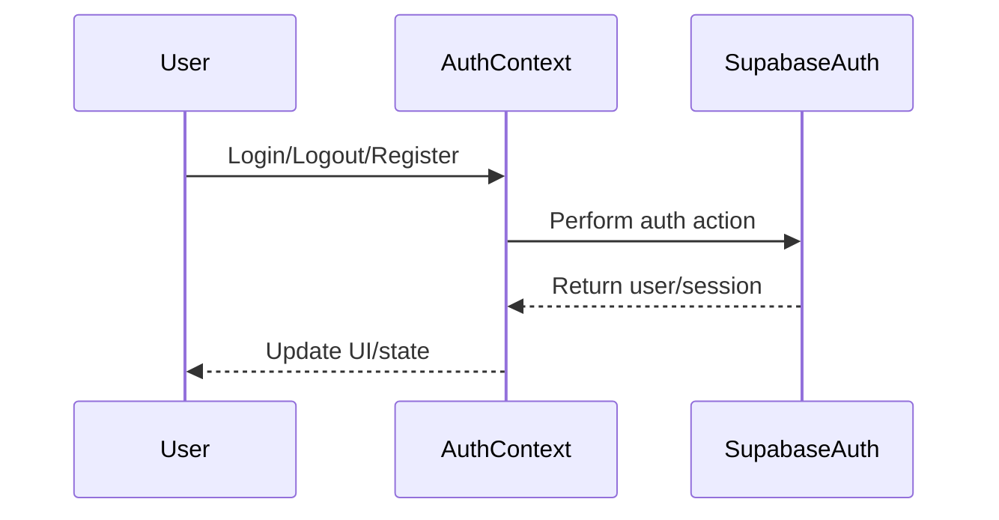

# Authentication Context

## Introduction
The Authentication Context manages user authentication state and provides user information and role-based access throughout the application. It ensures that only authenticated users can access protected resources and features.

## What Problem Does It Solve?
- Centralizes authentication logic and user state management.
- Makes user and session data easily accessible to all components.
- Simplifies role-based access control in the frontend.

## Key Concepts
- **User State:** Tracks the current user's authentication status, profile, and role.
- **Session Management:** Handles login, logout, and session persistence.
- **Role-Based Access:** Determines what features or pages a user can access based on their role (e.g., user, admin).

## Data Flow Diagram Context

## Use Cases Diagram Context
- User logs in or registers.
- User session is persisted across page reloads.
- Components check user role to show/hide features.

## Database Design
- Relies on `users`, `profiles`, and `user_roles` tables for authentication and user data.

---
The Authentication Context is the backbone of secure and personalized user experiences in the application. 