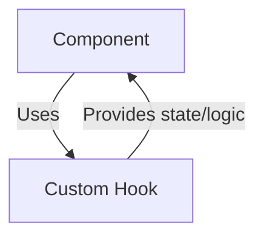

# Custom React Hooks

## Introduction
Custom React Hooks encapsulate reusable logic for state management, side effects, and UI behavior, making it easy to share functionality across components.

## What Problem Does It Solve?
- Avoids code duplication by abstracting common logic.
- Simplifies complex UI interactions and state management.
- Enhances code readability and maintainability.

## Key Concepts
- **Stateful Logic:** Encapsulates state and side effects for specific features (e.g., mobile detection, toast notifications).
- **Composable Functions:** Hooks can be combined to build more complex behaviors.

## Data Flow Diagram Context

## Use Cases Diagram Context
- Detecting mobile device usage for responsive design.
- Managing toast notifications for user feedback.
- Handling form state and validation.

---
Custom React Hooks empower developers to build modular and maintainable UI logic.

## Index
- [use-mobile.tsx](#use-mobiletsx)
- [use-toast.ts](#use-toastts)

---

## use-mobile.tsx

### Data Flow Diagram Context
- Detects mobile device usage and provides responsive logic.

### Use Cases Diagram Context
- Used by components to adapt UI for mobile devices.

---

## use-toast.ts

### Data Flow Diagram Context
- Manages toast notifications and their state.

### Use Cases Diagram Context
- Used by components to display feedback messages to users. 