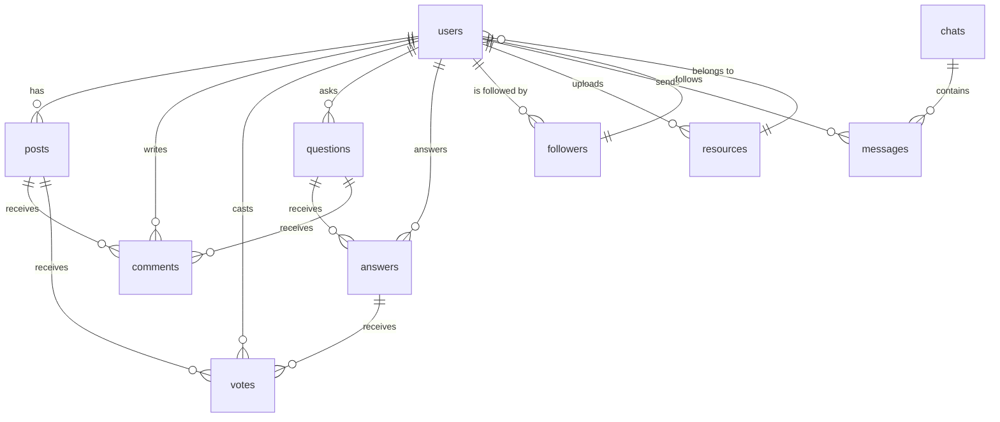

# Database Design Documentation

This document provides an overview of the main database tables and their relationships for the Focus Hub project. It is based on the migration files in the Supabase setup.

## Entity-Relationship Diagram (ERD) Context

- **users**: Stores user account information.
- **posts**: Represents social feed posts.
- **comments**: Stores comments on posts and Q&A.
- **votes**: Tracks upvotes/downvotes on posts and answers.
- **questions**: Q&A module questions.
- **answers**: Q&A module answers.
- **followers**: Tracks user follow relationships.
- **resources**: Shared files and resources.
- **chats**: Chat conversations between users.
- **messages**: Individual chat messages.

## Table Descriptions

### users
- id (PK)
- email
- password_hash
- display_name
- created_at

### posts
- id (PK)
- user_id (FK)
- content
- created_at

### comments
- id (PK)
- post_id (FK)
- user_id (FK)
- content
- created_at

### votes
- id (PK)
- user_id (FK)
- post_id (FK)
- vote_type
- created_at

### questions
- id (PK)
- user_id (FK)
- title
- body
- created_at

### answers
- id (PK)
- question_id (FK)
- user_id (FK)
- content
- created_at

### followers
- id (PK)
- user_id (FK)
- follower_id (FK)
- created_at

### resources
- id (PK)
- user_id (FK)
- file_url
- description
- created_at

### chats
- id (PK)
- created_at

### messages
- id (PK)
- chat_id (FK)
- sender_id (FK)
- content
- created_at

---

For detailed schema, see the Supabase migration files in `supabase/migrations/`. 