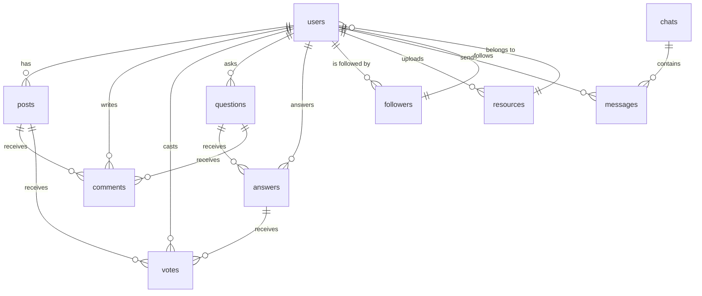

# Database Design & ERD

## Introduction
The database design defines the structure, relationships, and security policies for all data stored in the application. A well-designed schema ensures data integrity, efficient queries, and robust access control.

## What Problem Does It Solve?
- Organizes data into logical tables and relationships.
- Enforces data consistency and referential integrity.
- Implements security through Row Level Security (RLS) policies.

## Key Concepts
- **Entities:** Users, posts, comments, votes, questions, answers, resources, chats, messages, etc.
- **Relationships:** Foreign keys link related data (e.g., posts to users, comments to posts).
- **RLS Policies:** Database-level rules that control who can access or modify each row.

## Entity-Relationship Diagram (ERD)

## Table Descriptions
- **users:** Stores user account information.
- **posts:** Social feed posts linked to users.
- **comments:** Comments on posts and Q&A.
- **votes:** Upvotes/downvotes on posts and answers.
- **questions:** Q&A module questions.
- **answers:** Q&A module answers.
- **followers:** User follow relationships.
- **resources:** Shared files and resources.
- **chats:** Chat conversations.
- **messages:** Individual chat messages.

## Summary
The database schema is the backbone of the application, supporting all features and enforcing security through well-defined relationships and RLS policies. 