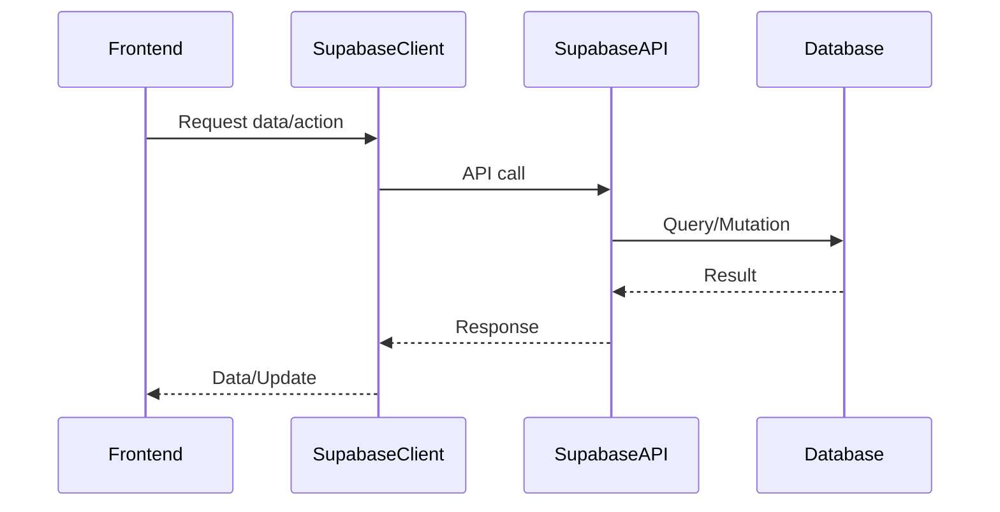

# External Integrations

## Introduction
External Integrations connect the application to third-party services such as Supabase for database, authentication, and real-time features. They enable the app to leverage powerful backend capabilities without building everything from scratch.

## What Problem Does It Solve?
- Provides scalable backend services (database, auth, storage, real-time) out of the box.
- Reduces development time and complexity.
- Ensures security and reliability through managed services.

## Key Concepts
- **Supabase Client:** The main interface for interacting with Supabase services.
- **Type Safety:** Uses generated types to ensure correct data structures.
- **Real-time Subscriptions:** Enables live updates for data changes.

## Data Flow Diagram Context

## Use Cases Diagram Context
- User authentication and session management.
- Real-time chat and feed updates.
- File storage and retrieval.

## Database Design
- Integrates with all core tables and storage buckets defined in the backend schema.

---
External Integrations are the foundation for scalable, secure, and feature-rich application development. 