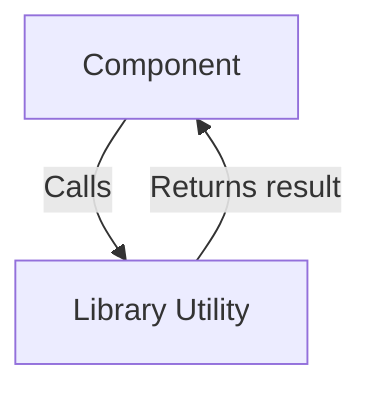

# Library Modules Documentation

This document provides an overview of all library modules in the project, including data flow and use case diagrams, and database design where relevant.

## Index
- [api.ts](#apits)
- [utils.ts](#utilsts)

---

## api.ts

### Data Flow Diagram Context
- Provides API utility functions for network requests.

### Use Cases Diagram Context
- Used by modules to interact with backend APIs.

---

## utils.ts

### Data Flow Diagram Context
- Contains utility functions for common operations.

### Use Cases Diagram Context
- Used across modules for helper logic.

# Library Utilities

## Introduction
Library Utilities provide reusable helper functions and abstractions that simplify common tasks throughout the application. They help keep the codebase DRY (Don't Repeat Yourself) and maintainable.

## What Problem Does It Solve?
- Reduces code duplication by centralizing common logic.
- Simplifies complex operations into easy-to-use functions.
- Improves code readability and maintainability.

## Key Concepts
- **API Helpers:** Functions for making network requests and handling responses.
- **Utility Functions:** General-purpose helpers for data formatting, validation, and transformation.

## Data Flow Diagram Context

## Use Cases Diagram Context
- Formatting dates and strings for display.
- Handling API errors and responses.
- Transforming data before rendering in the UI.

---
Library Utilities are the building blocks that support the main features of the application, ensuring consistency and efficiency. 