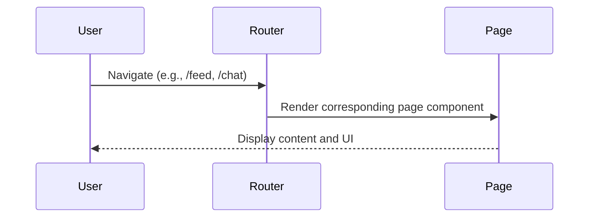

# Main Application Pages

## Introduction
The Main Application Pages represent the core user-facing screens of the platform, such as the feed, chat, profile, settings, and authentication flows. Each page is designed to provide a seamless and interactive experience, leveraging modular components and real-time data.

## What Problem Does It Solve?
- Organizes the application into clear, navigable sections.
- Provides dedicated interfaces for different user tasks (e.g., posting, chatting, managing profile).
- Ensures a consistent user experience across the platform.

## Key Concepts
- **Page Components:** Each page encapsulates a specific feature or workflow (e.g., Feed, Chat, Profile).
- **Routing:** Navigation between pages is managed by a router, enabling smooth transitions and deep linking.
- **Layout:** Shared layout components (header, sidebar) provide consistency and context.

## Data Flow Diagram Context

## Use Cases Diagram Context
- User browses the social feed.
- User participates in chat conversations.
- User updates their profile or settings.
- User logs in, registers, or resets password.

## Database Design
- Pages interact with various tables such as `users`, `posts`, `chats`, `profiles`, depending on their function.

---
Main Application Pages are the entry points for all user interactions and workflows in the platform.

# Pages Documentation

This document provides an overview of all pages in the project, including data flow and use case diagrams, and database design where relevant.

## Index
- [QandA.tsx](#qandatsx)
- [Index.tsx](#indextsx)
- [Chat.tsx](#chattsx)
- [AdminDashboard.tsx](#admindashboardtsx)
- [Settings.tsx](#settingstsx)
- [Profile.tsx](#profiletsx)
- [AppRedirect.tsx](#appredirecttsx)
- [Login.tsx](#logintsx)
- [Register.tsx](#registertsx)
- [FollowersList.tsx](#followerslisttsx)
- [FollowingList.tsx](#followinglisttsx)
- [Resources.tsx](#resourcestsx)
- [Feed.tsx](#feedtsx)
- [AdminWelcome.tsx](#adminwelcometsx)
- [ForgotPassword.tsx](#forgotpasswordtsx)
- [NotFound.tsx](#notfoundtsx)

---

## QandA.tsx
### Data Flow Diagram Context
- Manages Q&A interactions, including posting questions and answers.
### Use Cases Diagram Context
- Users can ask questions, answer, and interact with Q&A content.
### Database Design
- Uses `questions`, `answers`, `comments`, and `votes` tables.

---

## Index.tsx
### Data Flow Diagram Context
- Main landing page, aggregates and routes to other modules.
### Use Cases Diagram Context
- Entry point for users, navigation hub.

---

## Chat.tsx
### Data Flow Diagram Context
- Handles real-time chat between users.
### Use Cases Diagram Context
- Users can send and receive messages in real time.
### Database Design
- Uses `messages` and `chats` tables.

---

## AdminDashboard.tsx
### Data Flow Diagram Context
- Admin interface for managing users and content.
### Use Cases Diagram Context
- Admins can view stats, moderate content, and manage users.

---

## Settings.tsx
### Data Flow Diagram Context
- User settings management, including preferences and account info.
### Use Cases Diagram Context
- Users can update their profile, preferences, and security settings.

---

## Profile.tsx
### Data Flow Diagram Context
- Displays and manages user profile information.
### Use Cases Diagram Context
- Users can view and edit their profile.

---

## AppRedirect.tsx
### Data Flow Diagram Context
- Handles application redirects based on user state.
### Use Cases Diagram Context
- Redirects users to appropriate pages after login or actions.

---

## Login.tsx
### Data Flow Diagram Context
- Manages user authentication and login flow.
### Use Cases Diagram Context
- Users can log in to access the application.
### Database Design
- Relies on `users` table for authentication.

---

## Register.tsx
### Data Flow Diagram Context
- Handles user registration and onboarding.
### Use Cases Diagram Context
- New users can create accounts.
### Database Design
- Relies on `users` table for registration.

---

## FollowersList.tsx
### Data Flow Diagram Context
- Displays list of followers for a user.
### Use Cases Diagram Context
- Users can view who follows them.
### Database Design
- Uses `followers` table.

---

## FollowingList.tsx
### Data Flow Diagram Context
- Displays list of users the current user is following.
### Use Cases Diagram Context
- Users can view who they are following.
### Database Design
- Uses `followers` table.

---

## Resources.tsx
### Data Flow Diagram Context
- Manages resource sharing and listing.
### Use Cases Diagram Context
- Users can share and access resources.
### Database Design
- Uses `resources` table.

---

## Feed.tsx
### Data Flow Diagram Context
- Displays social feed with posts and updates.
### Use Cases Diagram Context
- Users can view and interact with the feed.
### Database Design
- Uses `posts` table.

---

## AdminWelcome.tsx
### Data Flow Diagram Context
- Welcome page for admins.
### Use Cases Diagram Context
- Greets admins upon login.

---

## ForgotPassword.tsx
### Data Flow Diagram Context
- Handles password reset flow.
### Use Cases Diagram Context
- Users can reset their password.
### Database Design
- Relies on `users` table for password management.

---

## NotFound.tsx
### Data Flow Diagram Context
- Displays 404 not found page.
### Use Cases Diagram Context
- Informs users when a page does not exist. 